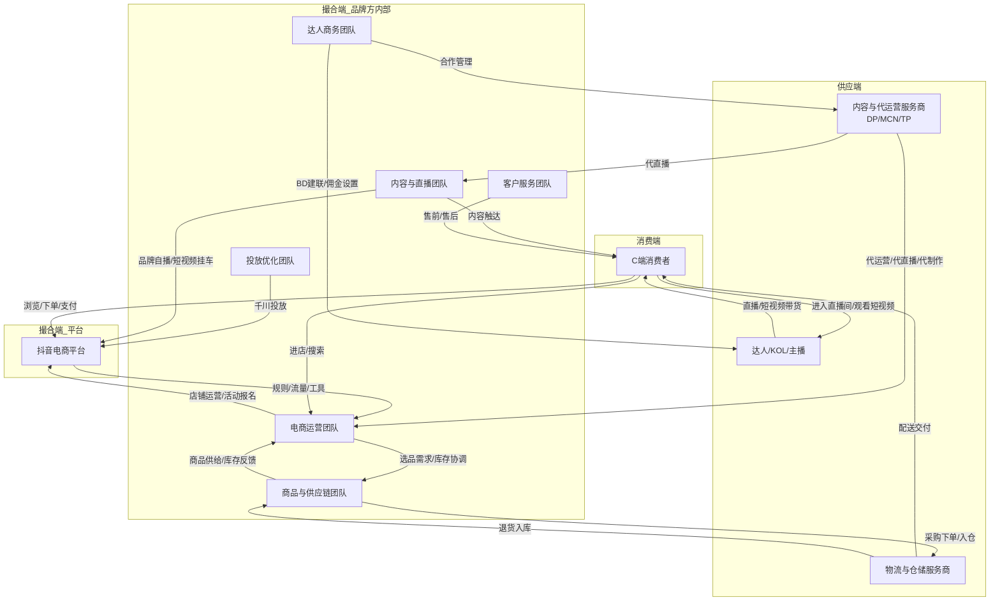

# 抖音电商品牌方 业务全流程拆解

## 一、业务概述

抖音电商品牌方以"全域兴趣电商"为核心模式，在抖音平台开设品牌店铺，通过**内容场**（品牌自播+短视频+达人带货）与**货架场**（商城搜索+商品卡+猜你喜欢）双场景协同运营，借助**千川全域推广**撬动付费与自然流量，实现从种草→转化→复购的完整电商闭环。品牌方既是商品供给者（生产端角色），也是运营操盘手（撮合端角色），内部按职能拆分为电商运营、内容直播、达人商务、投放优化、客服、供应链六大核心团队，形成"以品牌为中心、平台为底座、达人与服务商为两翼"的协同网络。

---

## 二、对象清单

| 编号 | 对象名称 | 类别 | 角色描述 |
|------|---------|------|---------|
| O1 | C端消费者 | 🟢 消费端 | 抖音用户，通过短视频/直播/搜索发现商品并下单购买 |
| O2 | 抖音电商平台 | 🔵 撮合端 | 提供店铺系统、流量分发、规则治理、数据工具的平台方 |
| O3 | 品牌方-电商运营团队 | 🔵 撮合端 | 店铺日常运营、商品卡优化、活动报名、数据分析 |
| O4 | 品牌方-内容与直播团队 | 🔵 撮合端 | 品牌自播、短视频创作、内容策划、直播间运营 |
| O5 | 品牌方-达人商务团队 | 🔵 撮合端 | 达人BD建联、精选联盟合作、佣金策略、MCN对接 |
| O6 | 品牌方-投放优化团队 | 🔵 撮合端 | 千川广告投放、ROI监控优化、素材测试迭代 |
| O7 | 品牌方-客户服务团队 | 🔵 撮合端 | 售前咨询引导、售后处理、DSR评分维护 |
| O8 | 品牌方-商品与供应链团队 | 🔵 撮合端 | 选品规划、采购生产、库存管理、仓储物流调度 |
| O9 | 达人/KOL/主播 | 🔴 供应端 | 内容创作者+分销渠道，通过直播/短视频为品牌带货 |
| O10 | 物流与仓储服务商 | 🔴 供应端 | 快递配送、云仓代发、退货逆向物流 |
| O11 | 内容与代运营服务商（DP/MCN/TP） | 🔴 供应端 | 为品牌提供直播代运营、短视频制作、店铺代运营服务 |

> **设计说明**：品牌方内部按职能拆为6个独立团队对象（O3-O8），每个团队有独立的业务链路和策略体系，分开拆解才能精准定位增长瓶颈。品牌方整体不作为独立对象——它分散为O3-O8六个子对象，分别对应平台内部的不同部门。

---

## 三、对象间关系总览

品牌方电商团队（O3-O8）是整张网络的中心枢纽：向左连接消费者（O1）通过内容与商品触达，向上依赖抖音平台（O2）的流量与规则体系，向右撬动达人（O9）与代运营（O11）的内容供给，向下驱动物流商（O10）完成履约。抖音平台既是规则制定者也是流量分发者，达人既是内容供给方也是分销渠道，三者与品牌方共同构成"平台管控→品牌操盘→达人分销→物流履约→用户消费"的完整价值链。

---

## 四、各对象行为路径（一级动作总览）

### 4.1 🟢 消费端：O1-C端消费者

1. **发现** — 刷短视频/看直播/搜索关键词/逛商城猜你喜欢，接触品牌商品
2. **兴趣激发** — 观看内容详情、查看商品评价、横向比价、领取优惠券
3. **下单支付** — 选规格（尺码/颜色）、填收货地址、选支付方式、完成支付
4. **等待收货** — 查看物流状态、催单/联系客服
5. **收货评价** — 签收验货、确认收货、文字/图片评价、晒单
6. **复购或流失** — 关注店铺/加入会员/再次购买/取关或转向其他品牌

### 4.2 🔵 撮合端：O2-抖音电商平台

1. **规则制定** — 店铺类型标准、品牌力分级体系、佣金门槛设定、体验分规则
2. **流量分发** — 内容推荐算法（短视频/直播）、商品卡搜索排名、猜你喜欢
3. **工具提供** — 抖店后台、巨量千川、精选联盟、数据罗盘
4. **交易履约** — 支付清算、订单管理、售后仲裁、发票管理
5. **治理处罚** — 违规监控（假货/虚假宣传）、扣分罚款、店铺清退

### 4.3 🔵 撮合端：O3-品牌方-电商运营团队

1. **店铺入驻与建设** — 申请开店、资质提交审核、店铺装修、商品上架
2. **商品卡运营** — 标题SEO优化、主图AB测试、详情页优化、搜索关键词布局
3. **活动运营** — 平台大促报名（618/双11/年货节）、店铺自营销、会员体系搭建
4. **数据分析与策略** — 流量/转化/客单/复购数据追踪、竞品监控、策略调整

### 4.4 🔵 撮合端：O4-品牌方-内容与直播团队

1. **内容策划** — 选题规划、脚本撰写、内容日历排期
2. **短视频制作** — 拍摄/剪辑/封面设计/挂车发布/话题标签
3. **品牌自播** — 直播间搭建、主播排班、话术设计、场控运营、福利节奏
4. **内容复盘** — 播放量/互动率/转化率分析、爆款内容拆解、迭代优化

### 4.5 🔵 撮合端：O5-品牌方-达人商务团队

1. **达人策略制定** — 达人分层（头部/腰部/KOC）、预算分配、品类-达人匹配
2. **达人BD建联** — 达人筛选评估、触达邀约、寄样沟通、合同签订
3. **精选联盟运营** — 佣金策略设置、商品入池、推广计划配置
4. **合作执行与复盘** — 直播排期跟进、短视频挂车发布、效果追踪结算

### 4.6 🔵 撮合端：O6-品牌方-投放优化团队

1. **投放策略制定** — 目标ROI设定、日/周预算规划、人群定向策略
2. **素材准备与测试** — 投放素材制作、AB测试、跑量素材筛选
3. **千川投放执行** — 计划搭建、出价调整、时段调控、全域双开
4. **数据优化** — 实时ROI监控、人群包迭代、计划优胜劣汰

### 4.7 🔵 撮合端：O7-品牌方-客户服务团队

1. **售前接待** — 商品咨询解答、尺码推荐、活动规则说明
2. **售后处理** — 退换货审核、仅退款处理、纠纷申诉举证
3. **DSR维护** — 好评引导策略、差评挽回沟通、服务分监控预警

### 4.8 🔵 撮合端：O8-品牌方-商品与供应链团队

1. **选品规划** — 市场趋势分析、竞品调研、品类结构设计、价格带规划
2. **采购生产** — 供应商筛选、OEM下单、品质把控、交期管理
3. **库存管理** — 安全库存设定、补货预警、滞销品清仓、效期管理
4. **仓储物流** — 入仓管理、发货调度、快递公司对接、退货处理

### 4.9 🔴 供应端：O9-达人/KOL/主播

1. **账号经营** — 内容定位与人设打造、粉丝积累与维护、账号数据优化
2. **选品接单** — 精选联盟选品浏览、品牌方邀约评估、佣金率谈判
3. **内容输出** — 直播带货（话术/节奏/逼单）、短视频挂车、种草测评
4. **结算复盘** — 佣金结算核对、带货数据复盘、合作品牌筛选优化

### 4.10 🔴 供应端：O10-物流与仓储服务商

1. **仓储接入** — 系统对接（ERP/WMS）、入仓验收、库位管理
2. **订单履约** — 拣货打包、面单打印、快递揽收、在途配送
3. **逆向物流** — 退货签收、质检分类、入库或退回品牌方

### 4.11 🔴 供应端：O11-内容与代运营服务商

1. **客户拓展** — 品牌客户开发、案例展示、方案提案、合同签订
2. **代运营执行** — 店铺代运营（商品卡/活动）、直播代播、短视频代制作
3. **效果交付** — 数据报告输出、KPI达成评估、续约或解约

---

## 五、动作分层拆解（≥3级 + 策略）

### 5.1 🟢 O1-C端消费者

#### O1-动作1：发现

| 层级 | 动作/子动作 | 父动作 | 策略选项（仅末级） |
|------|-----------|--------|------------------|
| L1 | 发现 | — | — |
| L2 | 内容场发现 | 发现 | — |
| L3 | 刷短视频信息流 | 内容场发现 | 策略A：算法推荐（兴趣标签匹配）\| 策略B：关注账号更新 \| 策略C：同城/附近推荐 |
| L3 | 进入直播间 | 内容场发现 | 策略A：信息流推荐直播间 \| 策略B：关注列表直播提醒 \| 策略C：搜索品类后进入直播间 |
| L2 | 货架场发现 | 发现 | — |
| L3 | 搜索框主动搜索 | 货架场发现 | 策略A：品类词搜索（"连衣裙""蛋白粉"）\| 策略B：品牌词搜索 \| 策略C：场景词搜索（"露营装备""情人节礼物"） |
| L3 | 商城页面浏览 | 货架场发现 | 策略A：猜你喜欢推荐 \| 策略B：频道页/类目页浏览 \| 策略C：大促活动页面 |
| L3 | 商品卡自然曝光 | 货架场发现 | 策略A：搜索结果页商品卡 \| 策略B：订单详情页推荐 \| 策略C：店铺首页商品卡 |
| L2 | 社交裂变发现 | 发现 | — |
| L3 | 好友分享/转发 | 社交裂变发现 | 策略A：私信分享商品链接 \| 策略B：评论区@好友 \| 策略C：粉丝群/社群分享 |

#### O1-动作2：兴趣激发

| 层级 | 动作/子动作 | 父动作 | 策略选项（仅末级） |
|------|-----------|--------|------------------|
| L1 | 兴趣激发 | — | — |
| L2 | 内容消费 | 兴趣激发 | — |
| L3 | 观看短视频种草 | 内容消费 | 策略A：完播判定兴趣 \| 策略B：点赞/收藏标记兴趣 \| 策略C：点击购物车跳转详情 |
| L3 | 在直播间互动 | 内容消费 | 策略A：公屏评论提问 \| 策略B：点击讲解卡 \| 策略C：加粉丝团/关注主播 |
| L2 | 商品信息查看 | 兴趣激发 | — |
| L3 | 查看商品详情页 | 商品信息查看 | 策略A：浏览主图+轮播图 \| 策略B：查看详情图文描述 \| 策略C：看商品讲解视频 |
| L3 | 查看评价 | 商品信息查看 | 策略A：看好评率+文字评价 \| 策略B：看买家秀/带图评价 \| 策略C：看追加评价（追评更可信） |
| L2 | 比价与决策 | 兴趣激发 | — |
| L3 | 横向比价 | 比价与决策 | 策略A：同款搜图比价（跨店/跨平台）\| 策略B：同类目价格带对比 \| 策略C：查看历史价格走势 |
| L3 | 领券凑单 | 比价与决策 | 策略A：领取店铺券/平台券 \| 策略B：凑满减门槛 \| 策略C：会员专享价/新人价 |
| L3 | 信任建立 | 比价与决策 | 策略A：看品牌资质（旗舰店/授权标识）\| 策略B：看销量/热销指数 \| 策略C：看店铺体验分/DSR |

#### O1-动作3：下单支付

| 层级 | 动作/子动作 | 父动作 | 策略选项（仅末级） |
|------|-----------|--------|------------------|
| L1 | 下单支付 | — | — |
| L2 | 订单确认 | 下单支付 | — |
| L3 | 选规格 | 订单确认 | 策略A：单品直接加购 \| 策略B：多SKU选择（颜色/尺码/规格）加购 |
| L3 | 填地址 | 订单确认 | 策略A：GPS自动定位 \| 策略B：历史地址一键填充 \| 策略C：手动输入新地址 |
| L3 | 选配送/服务 | 订单确认 | 策略A：标准快递配送 \| 策略B：顺丰/京东加急配送 \| 策略C：到店自提（如适用） |
| L2 | 支付完成 | 下单支付 | — |
| L3 | 选支付方式 | 支付完成 | 策略A：抖音支付（默认）\| 策略B：微信支付/支付宝 \| 策略C：银行卡/花呗/白条分期 |
| L3 | 使用优惠 | 支付完成 | 策略A：自动匹配最优优惠组合 \| 策略B：手动勾选优惠券 \| 策略C：使用Dou分期免息 |

#### O1-动作4：等待收货

| 层级 | 动作/子动作 | 父动作 | 策略选项（仅末级） |
|------|-----------|--------|------------------|
| L1 | 等待收货 | — | — |
| L2 | 物流查看 | 等待收货 | — |
| L3 | 查看物流状态 | 物流查看 | 策略A：抖店App/抖音内物流跟踪 \| 策略B：快递公司官网/小程序查询 \| 策略C：短信/推送通知 |
| L3 | 催单 | 物流查看 | 策略A：App内一键催单 \| 策略B：联系商家客服催单 \| 策略C：联系快递员 |
| L2 | 异常沟通 | 等待收货 | — |
| L3 | 物流异常 | 异常沟通 | 策略A：联系商家客服查询 \| 策略B：申请平台介入 \| 策略C：直接申请退款 |

#### O1-动作5：收货评价

| 层级 | 动作/子动作 | 父动作 | 策略选项（仅末级） |
|------|-----------|--------|------------------|
| L1 | 收货评价 | — | — |
| L2 | 收货验收 | 收货评价 | — |
| L3 | 签收方式 | 收货验收 | 策略A：本人当面签收 \| 策略B：快递柜/驿站代收 \| 策略C：按门牌号放置拍照确认 |
| L3 | 验货确认 | 收货验收 | 策略A：即时开箱检查 \| 策略B：事后发现质量问题申诉 |
| L2 | 评价反馈 | 收货评价 | — |
| L3 | 写评价 | 评价反馈 | 策略A：仅星级评分 \| 策略B：文字+图片/视频评价 \| 策略C：追评/追加晒图（可得平台激励） |
| L3 | 售后申请 | 评价反馈 | 策略A：七天无理由退换 \| 策略B：质量问题仅退款 \| 策略C：投诉商家（虚假宣传/发错货） |

#### O1-动作6：复购或流失

| 层级 | 动作/子动作 | 父动作 | 策略选项（仅末级） |
|------|-----------|--------|------------------|
| L1 | 复购或流失 | — | — |
| L2 | 复购触发 | 复购或流失 | — |
| L3 | 再次购买 | 复购触发 | 策略A：历史订单"再来一单" \| 策略B：关注店铺→上新提醒触发 \| 策略C：直播间复购（老粉专属价） |
| L3 | 会员绑定 | 复购触发 | 策略A：加入店铺会员享积分 \| 策略B：付费会员卡（年度折扣） \| 策略C：粉丝群运营（专属福利/秒杀） |
| L2 | 流失行为 | 复购或流失 | — |
| L3 | 沉默/流失 | 流失行为 | 策略A：连续30天无互动/购买 \| 策略B：取消关注/退出粉丝群 \| 策略C：竞品持续复购替代 |

---

### 5.2 🔵 O2-抖音电商平台

#### O2-动作1：规则制定

| 层级 | 动作/子动作 | 父动作 | 策略选项（仅末级） |
|------|-----------|--------|------------------|
| L1 | 规则制定 | — | — |
| L2 | 准入规则 | 规则制定 | — |
| L3 | 店铺类型与品牌力 | 准入规则 | 策略A：品牌力三级制（高/中/低）\| 策略B：商标R标/TM标分级授权 \| 策略C：品类资质准入（食品/美妆/3C特殊要求） |
| L3 | 保证金与费率 | 准入规则 | 策略A：阶梯保证金（按类目）\| 策略B：0元试运营（前100单免保证金）\| 策略C：技术服务费阶梯制（0.6%-5%） |
| L2 | 运营规则 | 规则制定 | — |
| L3 | 体验分体系 | 运营规则 | 策略A：商品体验分（品质退货率/差评率）\| 策略B：物流体验分（揽收及时率/配送时长）\| 策略C：服务体验分（回复率/售后处理时效） |
| L3 | 佣金规则 | 运营规则 | 策略A：精选联盟佣金下限（2026年起5%）\| 策略B：免佣返佣政策（商品卡/新商家） |
| L2 | 处罚规则 | 规则制定 | — |
| L3 | 违规处罚 | 处罚规则 | 策略A：扣分制（累计扣分触发降权/关店）\| 策略B：罚款制（假货三倍罚款/虚假宣传罚款）\| 策略C：保证金扣除→补缴→清退三级递进 |

#### O2-动作2：流量分发

| 层级 | 动作/子动作 | 父动作 | 策略选项（仅末级） |
|------|-----------|--------|------------------|
| L1 | 流量分发 | — | — |
| L2 | 内容场流量 | 流量分发 | — |
| L3 | 短视频流量 | 内容场流量 | 策略A：兴趣标签推荐（协同过滤）\| 策略B：实时热度加权（完播/互动率）\| 策略C：电商流量池（挂车视频专项分发） |
| L3 | 直播间流量 | 内容场流量 | 策略A：自然推荐（停留/互动/成交数据加权）\| 策略B：付费流量（千川直投直播间）\| 策略C：广场页排序（分类/热度/距离） |
| L2 | 货架场流量 | 流量分发 | — |
| L3 | 商品卡流量 | 货架场流量 | 策略A：搜索排序（标题关键词匹配+商品体验分）\| 策略B：猜你喜欢（用户行为标签匹配）\| 策略C：频道页/活动页展示位 |
| L3 | 店铺流量 | 货架场流量 | 策略A：品牌搜索直达（品牌专区）\| 策略B：店铺推荐（首页/支付成功页） |

---

### 5.3 🔵 O3-品牌方-电商运营团队

#### O3-动作1：店铺入驻与建设

| 层级 | 动作/子动作 | 父动作 | 策略选项（仅末级） |
|------|-----------|--------|------------------|
| L1 | 店铺入驻与建设 | — | — |
| L2 | 开店决策 | 店铺入驻与建设 | — |
| L3 | 店铺类型选择 | 开店决策 | 策略A：官方旗舰店（品牌直营、最高流量权重）\| 策略B：专卖店（分销渠道、一/二级授权）\| 策略C：专营店（多品牌集合、灵活经营） |
| L3 | 主体选择 | 开店决策 | 策略A：品牌方自有公司主体 \| 策略B：经销商/代运营公司代开 |
| L2 | 入驻提交 | 店铺入驻与建设 | — |
| L3 | 资质准备 | 入驻提交 | 策略A：自有品牌（商标注册证+营业执照）\| 策略B：授权品牌（品牌授权书+商标证）\| 策略C：代运营模式（品牌授权+代运营协议） |
| L3 | 保证金缴纳 | 入驻提交 | 策略A：一次性缴纳标准保证金 \| 策略B：0元试运营（前100单免缴） |
| L2 | 店铺装修 | 店铺入驻与建设 | — |
| L3 | 首页设计 | 店铺装修 | 策略A：模板化装修（平台标准组件）\| 策略B：品牌定制装修（自定义页面+品牌视觉） |
| L3 | 商品上架 | 店铺装修 | 策略A：手动逐品上架 \| 策略B：ERP批量导入 \| 策略C：第三方搬家工具（从淘宝/京东搬家） |

#### O3-动作2：商品卡运营（核心动作）

| 层级 | 动作/子动作 | 父动作 | 策略选项（仅末级） |
|------|-----------|--------|------------------|
| L1 | 商品卡运营 | — | — |
| L2 | 搜索SEO优化 | 商品卡运营 | — |
| L3 | 标题优化 | 搜索SEO优化 | 策略A：品类词+属性词+场景词组合（"2026夏季 冰丝防晒衣 UPF50+"）\| 策略B：蹭热点词/蓝海词 \| 策略C：竞品标题反查+差异化 |
| L3 | 关键词布局 | 搜索SEO优化 | 策略A：精准长尾词覆盖（搜索量低但转化高）\| 策略B：大词抢排名（高搜索量高竞争）\| 策略C：品牌词防御（买品牌专区/品牌关键词） |
| L2 | 主图与转化率优化 | 商品卡运营 | — |
| L3 | 主图测试 | 主图与转化率优化 | 策略A：AB测试不同主图点击率 \| 策略B：功能图vs场景图vs模特图轮换测试 \| 策略C：主图叠加卖点文字（价格/促销/包邮） |
| L3 | 详情页优化 | 主图与转化率优化 | 策略A：长图详情（品牌故事+产品卖点+规格参数+买家秀）\| 策略B：短视频详情（主图视频+讲解视频）\| 策略C：轻详情（移动端优化，首屏出核心卖点） |
| L2 | 价格与SKU策略 | 商品卡运营 | — |
| L3 | 定价策略 | 价格与SKU策略 | 策略A：高价高促（定价高+大促降价）\| 策略B：日常实价（定价即成交价）\| 策略C：引流款/利润款/形象款三层定价 |
| L3 | SKU设计 | 价格与SKU策略 | 策略A：多SKU覆盖（颜色/尺码/口味全覆盖）\| 策略B：精简SKU（只保留热销规格）\| 策略C：低价引流SKU+主推款引导 |

#### O3-动作3：活动运营

| 层级 | 动作/子动作 | 父动作 | 策略选项（仅末级） |
|------|-----------|--------|------------------|
| L1 | 活动运营 | — | — |
| L2 | 平台大促 | 活动运营 | — |
| L3 | 大促报名 | 平台大促 | 策略A：全量报名（618/双11/年货节全覆盖）\| 策略B：聚焦1-2个大促重点投入 \| 策略C：错峰促销（避开大促高峰竞争，日常做活动） |
| L3 | 活动选品 | 平台大促 | 策略A：爆品参促冲GMV \| 策略B：新品参促冲冷启动 \| 策略C：清仓品参促清理库存 |
| L2 | 店铺自营销 | 活动运营 | — |
| L3 | 营销工具 | 店铺自营销 | 策略A：限时秒杀/新人价 \| 策略B：满减/多件多折 \| 策略C：裂变券/分享有礼 |
| L3 | 会员运营 | 店铺自营销 | 策略A：会员专享价 \| 策略B：积分兑换/积分抵现 \| 策略C：会员日专属活动 |
| L2 | 内容营销协同 | 活动运营 | — |
| L3 | 直播+活动联动 | 内容营销协同 | 策略A：直播间专享价（仅直播时段有效）\| 策略B：短视频挂载活动商品 \| 策略C：达人专场+店铺活动同步 |

#### O3-动作4：数据分析与策略

| 层级 | 动作/子动作 | 父动作 | 策略选项（仅末级） |
|------|-----------|--------|------------------|
| L1 | 数据分析与策略 | — | — |
| L2 | 数据监控 | 数据分析与策略 | — |
| L3 | 核心指标追踪 | 数据监控 | 策略A：GMV/UV/转化率/客单价日看板 \| 策略B：周度品类结构分析 \| 策略C：月度经营复盘+年度规划 |
| L3 | 竞品监控 | 数据监控 | 策略A：飞瓜/蝉妈妈等第三方工具监控 \| 策略B：手动跟踪竞品SKU/价格/活动 \| 策略C：平台官方市场洞察工具 |
| L2 | 策略调整 | 数据分析与策略 | — |
| L3 | 流量策略 | 策略调整 | 策略A：付费流量占比调优（提升ROI）\| 策略B：免费流量渠道拓展（商品卡/搜索SEO）\| 策略C：达人流量补充（加大精选联盟投入） |
| L3 | 商品策略 | 策略调整 | 策略A：爆品矩阵扩展（爆品→关联品类延伸）\| 策略B：滞销品下架/调价 \| 策略C：新品梯队培育（月度上新节奏） |

---

### 5.4 🔵 O4-品牌方-内容与直播团队

#### O4-动作1：内容策划

| 层级 | 动作/子动作 | 父动作 | 策略选项（仅末级） |
|------|-----------|--------|------------------|
| L1 | 内容策划 | — | — |
| L2 | 选题规划 | 内容策划 | — |
| L3 | 内容方向 | 选题规划 | 策略A：产品种草型（功能演示+使用场景）\| 策略B：品牌故事型（品牌理念+创始人IP）\| 策略C：热点借势型（节日/社会热点/平台话题挑战） |
| L3 | 内容排期 | 选题规划 | 策略A：日更模式（每天1-3条短视频）\| 策略B：精品模式（每周2-3条高质量）\| 策略C：大促加频（活动期间提升发布频率） |
| L2 | 脚本创作 | 内容策划 | — |
| L3 | 脚本结构 | 脚本创作 | 策略A：黄金3秒开头+卖点展开+促单结尾 \| 策略B：故事叙事型（痛点→解决方案→产品）\| 策略C：测评对比型（竞品vs本品） |

#### O4-动作2：品牌自播（核心动作）

| 层级 | 动作/子动作 | 父动作 | 策略选项（仅末级） |
|------|-----------|--------|------------------|
| L1 | 品牌自播 | — | — |
| L2 | 直播间搭建 | 品牌自播 | — |
| L3 | 场景搭建 | 直播间搭建 | 策略A：品牌实体店场景（真实感+信任感）\| 策略B：绿幕虚拟背景（灵活换品）\| 策略C：工厂/仓库实景（源头直供感） |
| L3 | 直播间选品 | 直播间搭建 | 策略A：过品模式（1-3分钟一个品，快速轮换）\| 策略B：单品打爆模式（1-2款产品深度讲解）\| 策略C：排品组合（引流款→利润款→福利款→利润款循环） |
| L2 | 主播运营 | 品牌自播 | — |
| L3 | 主播培养 | 主播运营 | 策略A：内部培养（店员/客服转型主播）\| 策略B：外部招聘（签约专业带货主播）\| 策略C：创始人/老板IP亲自播 |
| L3 | 话术设计 | 主播运营 | 策略A：痛点唤醒→产品展示→信任背书→逼单成交 \| 策略B：福利节奏（整点秒杀/福袋抽奖留人） |
| L2 | 流量运营 | 品牌自播 | — |
| L3 | 自然流量获取 | 流量运营 | 策略A：直播间停留时长优化（互动玩法提升）\| 策略B：成交密度冲刺（集中放单拉升流量）\| 策略C：直播切片分发（直播高光片段发短视频反哺直播间） |
| L3 | 付费流量协同 | 流量运营 | 策略A：千川直投直播间 \| 策略B：短视频引流直播间（素材加热→直播）|

#### O4-动作3：内容复盘

| 层级 | 动作/子动作 | 父动作 | 策略选项（仅末级） |
|------|-----------|--------|------------------|
| L1 | 内容复盘 | — | — |
| L2 | 数据复盘 | 内容复盘 | — |
| L3 | 关键指标 | 数据复盘 | 策略A：短视频维度（播放量/完播率/互动率/挂车点击率）\| 策略B：直播维度（场观/停留时长/互动率/GPM/转化率） |
| L3 | 迭代方向 | 数据复盘 | 策略A：爆款复刻（复制爆款选题和结构）\| 策略B：低效内容淘汰（下架/优化重发）\| 策略C：跨品类对标（学习其他品类优质内容） |

---

### 5.5 🔵 O5-品牌方-达人商务团队

#### O5-动作1：达人策略制定

| 层级 | 动作/子动作 | 父动作 | 策略选项（仅末级） |
|------|-----------|--------|------------------|
| L1 | 达人策略制定 | — | — |
| L2 | 达人分层 | 达人策略制定 | — |
| L3 | 分层标准 | 达人分层 | 策略A：按粉丝量（头部>500万/腰部50-500万/KOC<50万）\| 策略B：按带货能力（GPM/场均GMV）\| 策略C：按品类匹配度（垂直类目达人优先） |
| L3 | 预算分配 | 达人分层 | 策略A：头部集中（预算大头给头部达人冲GMV）\| 策略B：金字塔分布（头部20%+腰部30%+KOC 50%）\| 策略C：纯KOC铺量（海量KOC内容种草） |
| L2 | 品类匹配 | 达人策略制定 | — |
| L3 | 达人-品类匹配 | 品类匹配 | 策略A：垂直达人优先（美妆品找美妆达人）\| 策略B：泛人群达人破圈（跨品类触达新人群）\| 策略C：竞品达人截图（挖角竞对合作达人） |

#### O5-动作2：达人BD建联

| 层级 | 动作/子动作 | 父动作 | 策略选项（仅末级） |
|------|-----------|--------|------------------|
| L1 | 达人BD建联 | — | — |
| L2 | 达人筛选 | 达人BD建联 | — |
| L3 | 筛选维度 | 达人筛选 | 策略A：看历史带货数据（GMV/转化率/GPM）\| 策略B：看粉丝画像匹配度（年龄/性别/消费力）\| 策略C：看内容调性是否与品牌契合 |
| L3 | 筛选工具 | 达人筛选 | 策略A：精选联盟达人广场筛选 \| 策略B：第三方数据平台（蝉妈妈/飞瓜）\| 策略C：竞对达人反查 |
| L2 | 触达邀约 | 达人BD建联 | — |
| L3 | 触达方式 | 触达邀约 | 策略A：精选联盟在线邀约 \| 策略B：私信/微信直接联系 \| 策略C：MCN机构批量对接 |
| L3 | 邀约话术 | 触达邀约 | 策略A：高佣吸引（突出佣金优势）\| 策略B：品牌背书（知名品牌+爆款产品）\| 策略C：样品+素材全套支持（降低达人合作门槛） |
| L2 | 寄样跟进 | 达人BD建联 | — |
| L3 | 样品策略 | 寄样跟进 | 策略A：免费寄样（无门槛）\| 策略B：买样返款（达人先购买、出内容后返款）\| 策略C：寄样+专属素材包（提供拍摄脚本/卖点文档） |

#### O5-动作3：精选联盟运营

| 层级 | 动作/子动作 | 父动作 | 策略选项（仅末级） |
|------|-----------|--------|------------------|
| L1 | 精选联盟运营 | — | — |
| L2 | 佣金策略 | 精选联盟运营 | — |
| L3 | 佣金率设置 | 佣金策略 | 策略A：基础门槛（5%通用佣金，最低曝光保障）\| 策略B：选品拐点（10%-15%高转化率区间）\| 策略C：高佣冲量（20%+，快速吸引达人选品） |
| L3 | 佣金类型 | 佣金策略 | 策略A：固定佣金（统一比例、管理简单）\| 策略B：阶梯佣金（销量越高佣金递增、激励达人冲量）\| 策略C：定向佣金（指定达人专属高佣金） |
| L2 | 推广计划 | 精选联盟运营 | — |
| L3 | 计划类型 | 推广计划 | 策略A：全部达人公开计划（最大曝光面）\| 策略B：指定达人定向计划（精准合作）\| 策略C：团长托管计划（委托招商团长分发） |
| L3 | 商品入池 | 推广计划 | 策略A：全店商品入池 \| 策略B：仅爆品/高佣品入池 \| 策略C：新品测试入池（小范围试水） |

#### O5-动作4：合作执行与复盘

| 层级 | 动作/子动作 | 父动作 | 策略选项（仅末级） |
|------|-----------|--------|------------------|
| L1 | 合作执行与复盘 | — | — |
| L2 | 直播跟进 | 合作执行与复盘 | — |
| L3 | 排期协调 | 直播跟进 | 策略A：提前2-4周锁定达人档期 \| 策略B：大促集中排期（618/双11前后密集合作）\| 策略C：日常常态化合作（每周固定达人场次） |
| L3 | 直播间支援 | 直播跟进 | 策略A：运营驻场配合（跟播+实时调整）\| 策略B：提供投流支持（为达人直播间加投千川） |
| L2 | 效果复盘 | 合作执行与复盘 | — |
| L3 | 核心指标 | 效果复盘 | 策略A：GMV/ROI/佣金成本 \| 策略B：带货口碑分/粉丝评价 \| 策略C：达人合作评级（S/A/B/C级，决定后续合作深度） |

---

### 5.6 🔵 O6-品牌方-投放优化团队

#### O6-动作1：投放策略制定

| 层级 | 动作/子动作 | 父动作 | 策略选项（仅末级） |
|------|-----------|--------|------------------|
| L1 | 投放策略制定 | — | — |
| L2 | 目标设定 | 投放策略制定 | — |
| L3 | ROI目标 | 目标设定 | 策略A：保本ROI（盈亏平衡、追求放量）\| 策略B：盈利ROI（追求利润、控制成本）\| 策略C：冲量ROI（战略性亏损、抢占市场份额） |
| L3 | 预算分配 | 目标设定 | 策略A：日预算制（每日固定预算）\| 策略B：周期预算制（周/月总预算灵活调配）\| 策略C：ROI联动制（ROI达标自动放量、不达标自动收紧） |
| L2 | 人群策略 | 投放策略制定 | — |
| L3 | 人群定向 | 人群策略 | 策略A：品牌人群（店铺粉丝/会员/历史购买用户）\| 策略B：品类人群（类目兴趣标签/竞品人群包）\| 策略C：通投（系统智能推荐、不设人群限制） |
| L3 | 人群测试 | 人群策略 | 策略A：多人群包同时跑量测试 \| 策略B：人群包由窄到宽逐步放量 \| 策略C：DMP自定义人群标签组合 |

#### O6-动作2：千川投放执行（核心动作）

| 层级 | 动作/子动作 | 父动作 | 策略选项（仅末级） |
|------|-----------|--------|------------------|
| L1 | 千川投放执行 | — | — |
| L2 | 投放模式 | 千川投放执行 | — |
| L3 | 场景选择 | 投放模式 | 策略A：全域推广（推商品）— 内容场+货架场双拿量 \| 策略B：内容场投放 — 短视频引流/直投直播间 \| 策略C：商品卡投放 — 搜索/猜你喜欢广告位 |
| L3 | 双开策略 | 投放模式 | 策略A：商品全域+直播全域双开 \| 策略B：仅商品全域 \| 策略C：仅直播全域 |
| L2 | 计划搭建 | 千川投放执行 | — |
| L3 | 出价策略 | 计划搭建 | 策略A：系统建议出价（降低5%-10%起量）\| 策略B：手动出价（根据经验和ROI目标设定）\| 策略C：自动出价（ROI目标约束下系统智能出价） |
| L3 | 素材配置 | 计划搭建 | 策略A：系统自动拉取商品卡（主图+轮播图）\| 策略B：手动上传定制素材（视频+图片）\| 策略C：素材库海量储备（≥80条轮换测试） |
| L3 | 计划数量 | 计划搭建 | 策略A：多计划赛马（10-20条计划同时跑、优胜劣汰）\| 策略B：少量精品计划（3-5条集中优化） |
| L2 | 素材测试 | 千川投放执行 | — |
| L3 | AB测试 | 素材测试 | 策略A：同品不同素材AB测试点击率/转化率 \| 策略B：同样素材不同人群包测试 \| 策略C：同样素材不同出价测试 |
| L3 | 跑量素材筛选 | 素材测试 | 策略A：消耗+ROI综合评估 \| 策略B：3天观察期 → 关闭低效素材 → 放大高效素材 |

#### O6-动作3：数据优化

| 层级 | 动作/子动作 | 父动作 | 策略选项（仅末级） |
|------|-----------|--------|------------------|
| L1 | 数据优化 | — | — |
| L2 | 实时监控 | 数据优化 | — |
| L3 | 关键指标 | 实时监控 | 策略A：实时ROI + 消耗速度 \| 策略B：千次展示成本（CPM）/ 点击成本（CPC）\| 策略C：计划生命周期（学习期→放量期→衰退期） |
| L3 | 异常处理 | 实时监控 | 策略A：ROI骤降→暂停/降低出价 \| 策略B：消耗跑不出去→提价/扩人群/换素材 \| 策略C：成本超标→立即暂停该计划 |
| L2 | 长期优化 | 数据优化 | — |
| L3 | 人群包迭代 | 长期优化 | 策略A：成交人群扩展（Lookalike）\| 策略B：排除已转化人群（减少重复投放）\| 策略C：人群包定期更新（月度/季度） |
| L3 | 投放节奏 | 长期优化 | 策略A：日常稳定投放 \| 策略B：大促期间集中放量+日常收缩 \| 策略C：新品期冲量→成熟期保ROI→衰退期缩减 |

---

### 5.7 🔵 O7-品牌方-客户服务团队

| 层级 | 动作/子动作 | 父动作 | 策略选项（仅末级） |
|------|-----------|--------|------------------|
| L1 | 客服管理 | — | — |
| L2 | 售前服务 | 客服管理 | — |
| L3 | 接待模式 | 售前服务 | 策略A：AI机器人自动应答（常见问题+商品推荐）\| 策略B：人工客服专属接待 \| 策略C：AI+人工混合（机器人过滤→人工接手复杂问题） |
| L3 | 促转化 | 售前服务 | 策略A：主动推荐（根据咨询推荐关联商品）\| 策略B：犹豫挽留（发优惠券/限时折扣促单） |
| L2 | 售后服务 | 客服管理 | — |
| L3 | 退换货处理 | 售后服务 | 策略A：极速退款（平台自动审核）\| 策略B：人工审核退款（逐一核实）\| 策略C：先行赔付（品牌方承担、后续追责物流） |
| L3 | 纠纷处理 | 售后服务 | 策略A：协商解决（补偿/换货）\| 策略B：平台仲裁（提交举证材料） |
| L2 | DSR维护 | 客服管理 | — |
| L3 | 好评提升 | DSR维护 | 策略A：好评返现/返券 \| 策略B：晒图有礼 \| 策略C：优质服务自然引导好评 |
| L3 | 差评管理 | DSR维护 | 策略A：差评即时联系用户道歉+补偿 \| 策略B：差评公开解释（澄清事实）\| 策略C：差评原因归类+运营改进 |

---

### 5.8 🔵 O8-品牌方-商品与供应链团队

#### O8-动作1：选品规划

| 层级 | 动作/子动作 | 父动作 | 策略选项（仅末级） |
|------|-----------|--------|------------------|
| L1 | 选品规划 | — | — |
| L2 | 市场分析 | 选品规划 | — |
| L3 | 趋势洞察 | 市场分析 | 策略A：平台趋势报告（抖音电商罗盘/巨量云图）\| 策略B：第三方数据（蝉妈妈/飞瓜品类趋势）\| 策略C：跨平台对标（淘宝/拼多多爆款迁移到抖音） |
| L3 | 竞品分析 | 市场分析 | 策略A：监控竞品上新节奏与定价 \| 策略B：分析竞品爆款特征（卖点/定价/内容打法） |
| L2 | 品类结构 | 选品规划 | — |
| L3 | 品类角色 | 品类结构 | 策略A：引流款（低价高转化引流）+利润款（中价高毛利保利润）+形象款（高价高品质立品牌）\| 策略B：单一爆款集中打透 \| 策略C：全品类覆盖做品牌旗舰店 |
| L3 | 上新节奏 | 品类结构 | 策略A：月度上新（每月固定上新1-3款）\| 策略B：季度按季节/趋势更新 \| 策略C：周度快反（跟爆款快速追品） |

#### O8-动作2：采购生产

| 层级 | 动作/子动作 | 父动作 | 策略选项（仅末级） |
|------|-----------|--------|------------------|
| L1 | 采购生产 | — | — |
| L2 | 供应商管理 | 采购生产 | — |
| L3 | 供应商筛选 | 供应商管理 | 策略A：自有工厂/入股工厂（品质可控）\| 策略B：OEM/ODM外协（灵活选厂）\| 策略C：现货采购（1688/批发市场快反） |
| L3 | 品控管理 | 供应商管理 | 策略A：全检（每件检验）\| 策略B：抽检（按批次抽检）\| 策略C：供应商自检+品牌抽检（信任+监督） |
| L2 | 生产排期 | 采购生产 | — |
| L3 | 备货策略 | 生产排期 | 策略A：按订单生产（MTO，零库存风险）\| 策略B：预测备货（MTS，提前备库存）\| 策略C：混合模式（基础款MTS+新款MTO） |

#### O8-动作3：库存与物流

| 层级 | 动作/子动作 | 父动作 | 策略选项（仅末级） |
|------|-----------|--------|------------------|
| L1 | 库存与物流 | — | — |
| L2 | 库存管理 | 库存与物流 | — |
| L3 | 库存策略 | 库存管理 | 策略A：安全库存制（设定最低库存预警线）\| 策略B：JIT零库存（与供应商协同实时补货）\| 策略C：爆品多仓备货（全国分仓缩短配送时效） |
| L3 | 滞销处理 | 库存管理 | 策略A：限时清仓/福袋/赠品 \| 策略B：退回供应商 \| 策略C：线下渠道消化（特卖/批发） |
| L2 | 物流履约 | 库存与物流 | — |
| L3 | 仓储模式 | 物流履约 | 策略A：品牌自有仓（品质+灵活度最高）\| 策略B：平台云仓（抖音仓/京东云仓）\| 策略C：第三方云仓（菜鸟/顺丰云仓） |
| L3 | 快递选择 | 物流履约 | 策略A：经济快递（三通一达/极兔，成本低）\| 策略B：品质快递（顺丰/京东，体验好）\| 策略C：经济+品质分层（高客单顺丰/低客单通达） |

---

### 5.9 🔴 O9-达人/KOL/主播

#### O9-动作1：选品接单

| 层级 | 动作/子动作 | 父动作 | 策略选项（仅末级） |
|------|-----------|--------|------------------|
| L1 | 选品接单 | — | — |
| L2 | 选品来源 | 选品接单 | — |
| L3 | 选品渠道 | 选品来源 | 策略A：精选联盟广场浏览选品 \| 策略B：品牌方主动邀约样品 \| 策略C：MCN/团长统一分发选品池 |
| L3 | 选品标准 | 选品来源 | 策略A：高佣金率优先（15%+）\| 策略B：高转化潜力（商品口碑/店铺体验分）\| 策略C：粉丝需求匹配（评论区/粉丝群调研） |
| L2 | 合作谈判 | 选品接单 | — |
| L3 | 佣金模式 | 合作谈判 | 策略A：纯佣合作（按CPS结算，无坑位费）\| 策略B：坑位费+佣金（头部达人常用）\| 策略C：保量协议（承诺最低GMV换独家高佣） |
| L3 | 合作深度 | 合作谈判 | 策略A：单次合作（一场直播/一条视频）\| 策略B：框架合作（月度/季度打包）\| 策略C：年框/独家签约（品牌专属达人） |

#### O9-动作2：内容输出

| 层级 | 动作/子动作 | 父动作 | 策略选项（仅末级） |
|------|-----------|--------|------------------|
| L1 | 内容输出 | — | — |
| L2 | 直播带货 | 内容输出 | — |
| L3 | 直播准备 | 直播带货 | 策略A：提前熟悉产品卖点+品牌Brief \| 策略B：提前发布预热视频引流 \| 策略C：设置专属优惠（粉丝专属价/福利品） |
| L3 | 直播执行 | 直播带货 | 策略A：过品模式（每品5-10分钟、快速轮换）\| 策略B：单品深讲（一二十分钟深度讲解一个品）\| 策略C：福利节奏驱动（整点秒杀+抽奖拉停留） |
| L2 | 短视频带货 | 内容输出 | — |
| L3 | 内容类型 | 短视频带货 | 策略A：测评种草（真实体验+优缺点）\| 策略B：教程/攻略型（使用教程+效果展示）\| 策略C：剧情植入（软植入产品到日常内容） |

---

### 5.10 🔴 O10-物流与仓储服务商

| 层级 | 动作/子动作 | 父动作 | 策略选项（仅末级） |
|------|-----------|--------|------------------|
| L1 | 物流履约 | — | — |
| L2 | 正向配送 | 物流履约 | — |
| L3 | 揽收时效 | 正向配送 | 策略A：当日达（当日截单前订单当日发出）\| 策略B：次日达（隔日发出、满足平台48h揽收要求）\| 策略C：预约揽收（定时上门取件） |
| L3 | 配送时效 | 正向配送 | 策略A：经济配送（3-5天，成本低）\| 策略B：次日/隔日达（顺丰/京东，体验好）\| 策略C：同城极速达（前置仓/即时配送） |
| L2 | 逆向物流 | 物流履约 | — |
| L3 | 退货处理 | 逆向物流 | 策略A：消费者自行寄回 \| 策略B：快递员上门取件 \| 策略C：菜鸟驿站/快递柜寄回 |
| L3 | 质检入库 | 逆向物流 | 策略A：全检入库（逐一检查退货品质）\| 策略B：抽检+自动化分拣 \| 策略C：退货直接销毁/报废（低残值品类） |

---

### 5.11 🔴 O11-内容与代运营服务商

| 层级 | 动作/子动作 | 父动作 | 策略选项（仅末级） |
|------|-----------|--------|------------------|
| L1 | 代运营服务 | — | — |
| L2 | 服务模式 | 代运营服务 | — |
| L3 | 服务范围 | 服务模式 | 策略A：全案代运营（店铺+直播+短视频+投放全覆盖）\| 策略B：模块化服务（仅直播代播/仅短视频制作/仅投放代投）\| 策略C：顾问咨询模式（策略指导+品牌方执行） |
| L3 | 收费模式 | 服务模式 | 策略A：固定月费 \| 策略B：固定月费+GMV提成 \| 策略C：纯佣合作（按GMV分成、高风险高回报） |
| L2 | 执行交付 | 代运营服务 | — |
| L3 | KPI设定 | 执行交付 | 策略A：GMV导向 \| 策略B：ROI导向 \| 策略C：粉丝增长/品牌声量导向 |
| L3 | 数据透明 | 执行交付 | 策略A：品牌方开子账号自主查看 \| 策略B：定期数据报告交付 \| 策略C：实时数据看板共享 |

---

## 六、关键策略对比总结

| 环节 | 策略 | 优势 | 劣势 | 适用场景 |
|------|------|------|------|---------|
| **店铺类型** | 官方旗舰店 | 最高流量权重、品牌信任度最强 | 一个品牌仅一家、入驻门槛高 | 知名品牌直营 |
| | 专卖店 | 多店分销、授权灵活 | 流量权重低于旗舰店 | 品牌授权经销商 |
| | 专营店 | 多品牌集合、品类丰富 | 品牌辨识度弱 | 渠道商/多品牌代理 |
| **达人合作** | 头部集中（大主播） | 单场GMV高、品牌声量大 | 坑位费高、利润薄、依赖性强 | 大促冲量/新品引爆 |
| | 金字塔分布（头腰KOC） | 风险分散、内容矩阵丰富 | 管理成本高、需强BD团队 | 日常稳定经营 |
| | 纯KOC铺量 | 成本可控、UGC内容量大 | 单达产出低、难出爆款 | 预算有限的中小品牌 |
| **佣金策略** | 基础佣金（5%-10%） | 成本可控、普惠覆盖 | 达人选取意愿低 | 成熟爆品/不愁卖的品 |
| | 中高佣金（10%-20%） | 达人选品意愿强、转化率高 | 毛利被压缩 | 大多数品类常规运营 |
| | 高佣冲量（20%+） | 快速吸引达人、新品冷启 | 盈利能力弱甚至亏损 | 新品破零/KOC铺量期 |
| **千川投放** | 全域推广（双开） | 内容+货架双场景拿量、ROI最优 | 对素材和人群要求高 | 有投放预算品牌 |
| | 仅商品卡投放 | 成本低（货架场CPM低于内容场） | 起量慢、天花板低 | 利润款/长尾款商品 |
| | 仅直投直播间 | 起量快、适合直播型品牌 | 素材消耗大、ROI波动大 | 直播强驱动的品牌 |
| **仓储模式** | 品牌自有仓 | 品质可控、售后灵活 | 成本高、管理重 | 高客单/高要求品类 |
| | 平台云仓（抖音仓） | 履约时效有保障、揽收率达标 | 灵活性弱、退货处理慢 | 重视体验分的品牌 |
| | 第三方云仓 | 成本适中、全国分仓覆盖 | 品质管控弱于自营 | 销量稳定的大多数品牌 |
| **客服模式** | AI+人工混合 | 成本低、常见问题响应即时 | 复杂场景需人工兜底 | 订单量大的品牌 |
| | 纯人工客服 | 服务质量高、客诉处理到位 | 成本高、难以规模化 | 高客单/高服务要求品牌 |
| **选品策略** | 爆款单点突破 | 资源集中、打透一个品 | 品类单一、抗风险能力弱 | 初创品牌/预算有限 |
| | 引流+利润+形象三层矩阵 | 结构健康、可持续经营 | 运营复杂度高 | 成熟品牌/多品类经营 |

---

## 七、拆解统计

| 对象 | 一级动作数 | 二级动作数 | 三级动作数（含策略标注） |
|------|----------|----------|---------------------|
| O1-C端消费者 | 6 | 14 | 33 |
| O2-抖音电商平台 | 5 | 9 | 18 |
| O3-品牌方-电商运营团队 | 4 | 11 | 27 |
| O4-品牌方-内容与直播团队 | 4 | 9 | 21 |
| O5-品牌方-达人商务团队 | 4 | 11 | 28 |
| O6-品牌方-投放优化团队 | 3 | 9 | 23 |
| O7-品牌方-客户服务团队 | 1 | 3 | 9 |
| O8-品牌方-商品与供应链团队 | 4 | 10 | 24 |
| O9-达人/KOL/主播 | 4 | 8 | 17 |
| O10-物流与仓储服务商 | 1 | 2 | 6 |
| O11-内容与代运营服务商 | 1 | 2 | 6 |
| **合计** | **37** | **88** | **212** |

---

## 八、总结

抖音电商品牌方的业务本质是**"以品牌商品为核心、全域内容为驱动、千川投放为杠杆"**的三角增长模型。品牌方在抖音生态中扮演双重角色——既是商品供给方（生产端），又是完整的运营操盘手（撮合端内部拆为6个独立团队）。核心增长公式为：

> **品牌GMV = 商品卡自然流量 × 转化率 + 品牌自播GMV + 达人带货GMV + 千川付费GMV**

增长瓶颈通常不是单一环节的问题，而是**选品供给 → 内容能力 → 达人杠杆 → 投放效率 → 履约体验**五个环节的连锁反应。例如差评率上升不仅影响转化率，还会触发平台体验分下降→商品卡流量降权→千川计划衰退的恶性循环。任何一个被忽视的对象，最终都会在GMV上体现。
