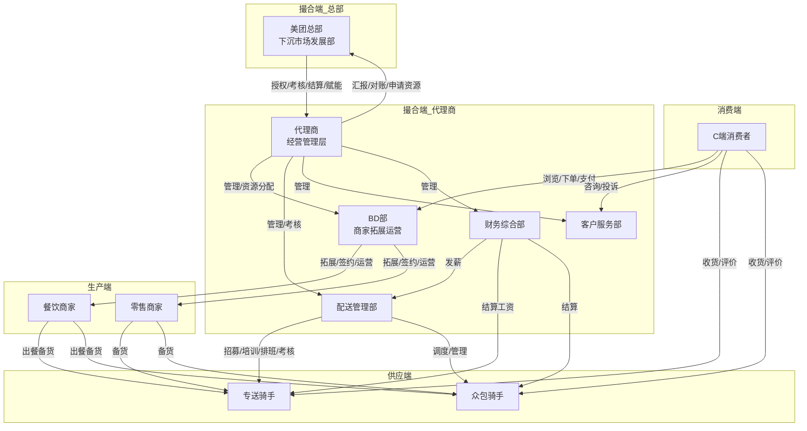

# 美团外卖代理商 业务全流程拆解

## 一、业务概述

美团外卖代理商是美团在下沉市场采用的"总部赋能 + 区域代理独立运营"轻资产扩张模式。代理商从美团获得区域独家授权，负责本地商家拓展（BD）、骑手招募与运力管理、用户服务等全链路运营。核心盈利来自订单佣金分成（5%-15%）、平台补贴激励和增值服务收入，同时承担本地人力、房租、推广等运营成本。截至2024年已覆盖全国4000+县区市，日订单量突破千万单。

---

## 二、对象清单

| 编号 | 对象名称 | 类别 | 角色描述 |
|------|---------|------|---------|
| O1 | C端消费者 | 🟢 消费端 | 通过美团App/小程序下单外卖的终端用户 |
| O2 | 美团总部（下沉市场发展部+渠道经理） | 🔵 撮合端 | 品牌授权方，负责代理商招募、规则制定、技术赋能、考核结算 |
| O3 | 代理商-经营管理层（城市经理） | 🔵 撮合端 | 代理商核心决策者，统筹本地商家拓展、配送履约、财务损益、总部对接 |
| O4 | 代理商-商家拓展与运营部（BD部） | 🔵 撮合端 | 一线商户拓展签约与日常运营维护团队 |
| O5 | 代理商-配送管理部 | 🔵 撮合端 | 骑手招募、培训、排班调度、站点管理、运力保障 |
| O6 | 代理商-客户服务部 | 🔵 撮合端 | 用户咨询、投诉处理、商家-骑手-用户三方纠纷协调 |
| O7 | 代理商-财务与综合部 | 🔵 撮合端 | 收入核算、支出管理、总部对账、人事行政 |
| O8 | 餐饮商家（含连锁品牌） | 🟠 生产端 | 入驻平台并提供餐品生产的本地餐饮商户 |
| O9 | 零售商家（便利店/生鲜/药店） | 🟠 生产端 | 入驻平台并提供零售商品的商户 |
| O10 | 专送骑手 | 🔴 供应端 | 代理商直接管理的全职配送人员，接受系统派单 |
| O11 | 众包骑手 | 🔴 供应端 | 兼职/灵活配送人员，自主抢单、弹性工作 |

---

## 三、对象间关系总览

代理商是连接美团总部、本地商家、骑手和消费者的核心枢纽。美团总部向代理商提供品牌授权、技术系统和规则约束；代理商通过BD部将本地商家引入平台，通过配送部组织骑手运力，消费者在平台上完成发现→下单→支付→收货→评价的完整闭环。各对象之间形成了"总部管控→代理运营→商家供给→骑手履约→用户消费"的五层价值链路。

---

## 四、各对象行为路径（一级动作总览）

### 4.1 🟢 消费端：O1-C端消费者

1. **发现** — 打开美团App，通过搜索/推荐/社交裂变发现餐厅
2. **浏览与决策** — 查看详情、评价、比价、领券、加购
3. **下单与支付** — 选规格、填地址、择支付方式、完成支付
4. **等待与追踪** — 查看订单进度、骑手位置、催单沟通
5. **收货与评价** — 取餐验货、确认收货、写评价、申请售后
6. **复购或流失** — 再次下单或转向竞品

### 4.2 🔵 撮合端：O2-美团总部

1. **区域规划与招募** — 划分代理区域、测算市场容量、发布招募
2. **签约授权** — 合同签署、系统权限开通、品牌授权
3. **培训赋能** — 业务培训、工具交付、持续指导
4. **考核管理** — KPI监控、定期评估、奖惩执行
5. **结算分账** — 订单佣金结算、补贴发放、数据对账

### 4.3 🔵 撮合端：O3-代理商经营管理层

1. **市场调研与投标** — 分析目标市场、评估竞对、准备资金与方案
2. **签约与资金筹备** — 与总部签约、缴纳保证金、准备运营资金
3. **团队组建** — 招聘BD负责人、配送站长、客服、财务
4. **运营监控** — 每日追踪订单量/GMV/履约率/利润率
5. **总部对接** — 与渠道经理沟通、争取资源、汇报业绩
6. **规模调整** — 根据损益决定扩张或收缩

### 4.4 🔵 撮合端：O4-代理商BD部

1. **商户拓展** — 线索搜集、上门拜访、商务谈判、签约入驻
2. **商户运营维护** — 菜单优化、活动配置、数据赋能、客情维护
3. **商户挽留** — 流失预警识别、制定挽留方案、挽留执行

### 4.5 🔵 撮合端：O5-代理商配送部

1. **骑手招募** — 线上线下招聘、面试筛选、签约入职
2. **骑手培训** — 安全培训、业务培训、系统操作
3. **运力调度** — 排班管理、实时调度、高峰期/异常应对
4. **骑手考核与留存** — 绩效管理、收入保障、关怀体系

### 4.6 🔵 撮合端：O6-代理商客服部

1. **投诉受理** — 多渠道接入、分级处理
2. **纠纷调解** — 责任判定、三方沟通、先行赔付
3. **服务改进** — 数据分析、根源改进

### 4.7 🔵 撮合端：O7-代理商财务与综合部

1. **收入核算** — 佣金汇总、补贴确认、增值收入对账
2. **支出管理** — 工资/房租/物料/推广费用支出
3. **总部对账** — 月度结算对账、差异申诉
4. **资金规划** — 现金流管理、利润分配

### 4.8 🟠 生产端：O8-餐饮商家

1. **入驻上线** — 平台选择决策、提交资料、菜单搭建、定价
2. **日常接单出餐** — 接单管理、厨房制作、打包出餐
3. **活动参与** — 满减/折扣/新客立减活动
4. **经营优化** — 数据分析、菜品调整、时段拓展
5. **续约或退出** — 评估ROI、决定继续或转向竞对

### 4.9 🟠 生产端：O9-零售商家

（行为路径与O8餐饮商家结构相同，品类从现制餐品扩展至预包装商品）

### 4.10 🔴 供应端：O10-专送骑手

1. **应聘入职** — 面试、签约、健康证、培训
2. **每日上岗** — 打卡、领装备、车辆检查
3. **接单取餐** — 系统派单、到店核验、取餐确认
4. **配送交付** — 路线执行、送达交付、异常处理
5. **收工结算** — 打卡签退、查看收入、提现

### 4.11 🔴 供应端：O11-众包骑手

1. **注册认证** — App注册、实名认证、线上培训
2. **自主抢单** — 登录App、抢单策略、跨平台接单
3. **取餐配送** — 同专送流程
4. **弹性收工** — 随时上下线、按单结算

---

## 五、动作分层拆解（≥3级 + 策略）

### 5.1 🟢 O1-C端消费者

#### O1-动作1：发现

| 层级 | 动作/子动作 | 父动作 | 策略选项（仅末级） |
|------|-----------|--------|------------------|
| L1 | 发现 | — | — |
| L2 | 主动搜索 | 发现 | — |
| L3 | 输入关键词搜索 | 主动搜索 | 策略A：品类关键词（"炸鸡""奶茶"）\| 策略B：店名精确搜索 \| 策略C：历史搜索快捷入口 |
| L3 | 筛选排序 | 主动搜索 | 策略A：按销量/评分排序 \| 策略B：按距离/配送费排序 \| 策略C：按优惠力度筛选 |
| L2 | 被动推荐 | 发现 | — |
| L3 | 首页信息流推荐 | 被动推荐 | 策略A：基于用户历史订单推荐 \| 策略B：基于时段/天气推荐（雨天推火锅）\| 策略C：基于LBS附近热门推荐 |
| L3 | 营销触达 | 被动推荐 | 策略A：Push推送（优惠券到期提醒）\| 策略B：短信/企业微信触达 \| 策略C：APP开屏/首页Banner广告 |
| L2 | 社交裂变 | 发现 | — |
| L3 | 好友分享 | 社交裂变 | 策略A：红包分享裂变 \| 策略B：拼单/拼好饭邀请 \| 策略C：订单分享得优惠 |

#### O1-动作2：浏览与决策

| 层级 | 动作/子动作 | 父动作 | 策略选项（仅末级） |
|------|-----------|--------|------------------|
| L1 | 浏览与决策 | — | — |
| L2 | 详情页浏览 | 浏览与决策 | — |
| L3 | 查看菜品信息 | 详情页浏览 | 策略A：图文详情 \| 策略B：短视频菜品展示 \| 策略C：用户实拍晒图 |
| L3 | 查看评价 | 详情页浏览 | 策略A：星级+文字评价 \| 策略B：带图评价优先展示 \| 策略C：标签化评价（"分量足""包装好"） |
| L2 | 比价与凑单 | 浏览与决策 | — |
| L3 | 横向比价 | 比价与凑单 | 策略A：同品类跨店比价 \| 策略B：含运费综合比价 \| 策略C：与饿了么同店比价 |
| L3 | 凑单满足门槛 | 比价与凑单 | 策略A：满减凑单推荐 \| 策略B：起送价补差商品推荐 \| 策略C：加价购/换购推荐 |
| L2 | 领券与决策 | 浏览与决策 | — |
| L3 | 领优惠券 | 领券与决策 | 策略A：店铺券（进店领取）\| 策略B：平台券（神券/会员红包）\| 策略C：支付券（银行卡/微信支付立减） |
| L3 | 加购决策 | 领券与决策 | 策略A：直接加购下单 \| 策略B：先收藏/稍后再买 \| 策略C：分享给他人征求意见 |

#### O1-动作3：下单与支付

| 层级 | 动作/子动作 | 父动作 | 策略选项（仅末级） |
|------|-----------|--------|------------------|
| L1 | 下单与支付 | — | — |
| L2 | 订单确认 | 下单与支付 | — |
| L3 | 选择收货地址 | 订单确认 | 策略A：GPS自动定位 \| 策略B：手动输入/从地址簿选择 \| 策略C：地图拖拽精确定位 |
| L3 | 选择配送方式 | 订单确认 | 策略A：立即配送（默认）\| 策略B：预约配送（指定时段）\| 策略C：到店自取 |
| L3 | 备注填写 | 订单确认 | 策略A：自由文本备注 \| 策略B：标签快捷备注（"不要辣""多放筷子"） |
| L2 | 支付执行 | 下单与支付 | — |
| L3 | 选择支付方式 | 支付执行 | 策略A：微信支付 \| 策略B：支付宝 \| 策略C：银行卡/美团月付/Apple Pay |
| L3 | 使用优惠 | 支付执行 | 策略A：自动匹配最优优惠组合 \| 策略B：手动勾选优惠券 \| 策略C：使用美团积分抵扣 |

#### O1-动作4：等待与追踪

| 层级 | 动作/子动作 | 父动作 | 策略选项（仅末级） |
|------|-----------|--------|------------------|
| L1 | 等待与追踪 | — | — |
| L2 | 订单状态查看 | 等待与追踪 | — |
| L3 | 查看进度 | 订单状态查看 | 策略A：进度条展示（已接单→备餐中→取餐中→配送中）\| 策略B：节点时间戳展示 \| 策略C：预计送达倒计时 |
| L3 | 查看骑手位置 | 订单状态查看 | 策略A：地图实时追踪骑手位置 \| 策略B：骑手距离/预计到达分钟数 \| 策略C：骑手电话一键拨打 |
| L2 | 催单与沟通 | 等待与追踪 | — |
| L3 | 催单 | 催单与沟通 | 策略A：一键催单（App内按钮）\| 策略B：联系骑手（在线消息/电话）\| 策略C：联系商家 |
| L3 | 在线沟通 | 催单与沟通 | 策略A：App内IM消息 \| 策略B：虚拟号码电话（隐私保护） |

#### O1-动作5：收货与评价

| 层级 | 动作/子动作 | 父动作 | 策略选项（仅末级） |
|------|-----------|--------|------------------|
| L1 | 收货与评价 | — | — |
| L2 | 取餐验收 | 收货与评价 | — |
| L3 | 当面取餐 | 取餐验收 | 策略A：本人当面签收 \| 策略B：放置指定位置（门把手/前台/外卖柜）\| 策略C：骑手拍照确认送达 |
| L3 | 餐品检查 | 取餐验收 | 策略A：即时开包检查 \| 策略B：事后发现问题通过App反馈 |
| L2 | 评价反馈 | 收货与评价 | — |
| L3 | 写评价 | 评价反馈 | 策略A：星级评分（1-5星）\| 策略B：文字+图片评价 \| 策略C：标签快捷评价（"好吃""包装好"） |
| L3 | 投诉/售后 | 评价反馈 | 策略A：App内自助退款 \| 策略B：联系客服人工处理 \| 策略C：电话投诉 |

#### O1-动作6：复购或流失

| 层级 | 动作/子动作 | 父动作 | 策略选项（仅末级） |
|------|-----------|--------|------------------|
| L1 | 复购或流失 | — | — |
| L2 | 复购触发 | 复购或流失 | — |
| L3 | 再次下单 | 复购触发 | 策略A：历史订单"再来一单"快捷入口 \| 策略B：收藏店铺上新提醒 \| 策略C：会员红包到期促使用户下单 |
| L3 | 会员体系绑定 | 复购触发 | 策略A：美团会员等级权益 \| 策略B：付费会员（美团外卖会员卡）\| 策略C：积分兑换激励 |
| L2 | 流失信号 | 复购或流失 | — |
| L3 | 沉默/流失行为 | 流失信号 | 策略A：连续N天未打开App \| 策略B：卸载App \| 策略C：转向竞对（饿了么）持续下单 |

---

### 5.2 🔵 O2-美团总部

#### O2-动作1：区域规划与代理商招募

| 层级 | 动作/子动作 | 父动作 | 策略选项（仅末级） |
|------|-----------|--------|------------------|
| L1 | 区域规划与代理商招募 | — | — |
| L2 | 区域划分 | 区域规划与代理商招募 | — |
| L3 | 市场测算 | 区域划分 | 策略A：按行政区域划分（区/县）\| 策略B：按商圈/网格划分 \| 策略C：按订单密度与人口画像划分 |
| L3 | 模式决策 | 区域划分 | 策略A：直营模式（一二线核心城市）\| 策略B：代理模式（下沉市场）\| 策略C：混合模式（部分直营+部分代理） |
| L2 | 招募筛选 | 区域规划与代理商招募 | — |
| L3 | 发布招募 | 招募筛选 | 策略A：官网公开招募+招商会 \| 策略B：渠道经理定向邀请 \| 策略C：现有代理商推荐/转介绍 |
| L3 | 评估审核 | 招募筛选 | 策略A：资金实力审核（验资+保证金）\| 策略B：本地资源评估（商家关系+配送资源）\| 策略C：团队能力面试 |

#### O2-动作2：签约授权

| 层级 | 动作/子动作 | 父动作 | 策略选项（仅末级） |
|------|-----------|--------|------------------|
| L1 | 签约授权 | — | — |
| L2 | 合同签署 | 签约授权 | — |
| L3 | 模式选择 | 合同签署 | 策略A：一级代理（直接签约、独立后台）\| 策略B：二级代理（挂靠一级、零硬性考核）\| 策略C：配送专送合作商 |
| L3 | 费用确定 | 合同签署 | 策略A：保证金+加盟费模式 \| 策略B：纯保证金模式（可退还）\| 策略C：阶梯式费用（按区域规模） |
| L2 | 系统授权 | 签约授权 | — |
| L3 | 后台开通 | 系统授权 | 策略A：独立代理商后台（完整权限）\| 策略B：受限后台（部分功能需总部审批） |
| L3 | 品牌授权 | 系统授权 | 策略A：统一品牌物料包（工服/外卖箱/门头）\| 策略B：代理商自行采购+总部审核 |

#### O2-动作3：培训赋能

| 层级 | 动作/子动作 | 父动作 | 策略选项（仅末级） |
|------|-----------|--------|------------------|
| L1 | 培训赋能 | — | — |
| L2 | 初期培训 | 培训赋能 | — |
| L3 | 业务培训 | 初期培训 | 策略A：集中线下培训（总部基地）\| 策略B：线上课程+考试 \| 策略C：渠道经理驻场带教 |
| L3 | 工具交付 | 初期培训 | 策略A：标准化SOP手册 \| 策略B：数据看板+后台系统教学 \| 策略C：陪跑期（前3个月渠道经理深度辅导） |
| L2 | 持续赋能 | 培训赋能 | — |
| L3 | 能力提升 | 持续赋能 | 策略A：定期线上培训（月度/季度）\| 策略B：优秀代理商经验分享会 \| 策略C：AI赋能工具（智能调度/精准营销） |

#### O2-动作4：考核管理

| 层级 | 动作/子动作 | 父动作 | 策略选项（仅末级） |
|------|-----------|--------|------------------|
| L1 | 考核管理 | — | — |
| L2 | 指标监控 | 考核管理 | — |
| L3 | 核心KPI设定 | 指标监控 | 策略A：订单量+GMV导向 \| 策略B：商家活跃率+新签数导向 \| 策略C：履约率+用户满意度导向 |
| L3 | 数据监控 | 指标监控 | 策略A：总部数据看板实时监控 \| 策略B：渠道经理定期巡检+评分 \| 策略C：系统自动预警（指标异常触发） |
| L2 | 奖惩执行 | 考核管理 | — |
| L3 | 激励 | 奖惩执行 | 策略A：达标奖金/超额分成 \| 策略B：荣誉称号+更多区域授权 \| 策略C：资源倾斜（更多补贴/流量支持） |
| L3 | 惩罚 | 奖惩执行 | 策略A：罚款/扣减保证金 \| 策略B：缩减代理区域 \| 策略C：取消代理资格/清退 |

#### O2-动作5：结算分账

| 层级 | 动作/子动作 | 父动作 | 策略选项（仅末级） |
|------|-----------|--------|------------------|
| L1 | 结算分账 | — | — |
| L2 | 佣金结算 | 结算分账 | — |
| L3 | 订单分账 | 佣金结算 | 策略A：按订单实收金额比例分成 \| 策略B：阶梯式分成（订单量越高比例越高）\| 策略C：固定服务费+增量分成 |
| L3 | 补贴结算 | 佣金结算 | 策略A：总部补贴（神券/满减）按比例分摊 \| 策略B：全额总部补贴（新客/大促）\| 策略C：代理商先行垫付+月度核销 |
| L2 | 对账核销 | 结算分账 | — |
| L3 | 对账周期 | 对账核销 | 策略A：T+1日对账 \| 策略B：周度对账 \| 策略C：月度统一对账 |
| L3 | 差异处理 | 对账核销 | 策略A：系统自动化对账+人工复核 \| 策略B：渠道经理线下确认 \| 策略C：仲裁流程 |

---

### 5.3 🔵 O3-代理商经营管理层

#### O3-动作1：市场调研与投标

| 层级 | 动作/子动作 | 父动作 | 策略选项（仅末级） |
|------|-----------|--------|------------------|
| L1 | 市场调研与投标 | — | — |
| L2 | 市场分析 | 市场调研与投标 | — |
| L3 | 竞争分析 | 市场分析 | 策略A：实地走访商家了解平台覆盖率 \| 策略B：数据工具抓取竞对订单量 \| 策略C：消费者问卷/访谈 |
| L3 | 盈利测算 | 市场分析 | 策略A：保守模型（最低订单量×最低分成）\| 策略B：乐观模型（参考同类城市标杆）\| 策略C：折中模型（取50分位数） |
| L2 | 投标准备 | 市场调研与投标 | — |
| L3 | 资金准备 | 投标准备 | 策略A：自有资金 \| 策略B：合伙人集资 \| 策略C：银行贷款/外部融资 |
| L3 | 方案撰写 | 投标准备 | 策略A：标准模板申请 \| 策略B：定制化运营方案（展示本地资源优势） |

#### O3-动作2：团队组建

| 层级 | 动作/子动作 | 父动作 | 策略选项（仅末级） |
|------|-----------|--------|------------------|
| L1 | 团队组建 | — | — |
| L2 | 核心岗位招募 | 团队组建 | — |
| L3 | BD负责人 | 核心岗位招募 | 策略A：挖角竞对BD管理层 \| 策略B：本地有商家资源的销售人才 \| 策略C：总部推荐/培训输出 |
| L3 | 配送站长 | 核心岗位招募 | 策略A：有外卖/快递配送管理经验者 \| 策略B：内部骑手晋升 \| 策略C：从物流行业跨界招聘 |
| L2 | 组织架构搭建 | 团队组建 | — |
| L3 | 架构设计 | 组织架构搭建 | 策略A：按职能划分（BD部/配送部/客服部/财务部）\| 策略B：按区域划分（各区域配独立小团队）\| 策略C：混合矩阵式 |

#### O3-动作3：运营监控

| 层级 | 动作/子动作 | 父动作 | 策略选项（仅末级） |
|------|-----------|--------|------------------|
| L1 | 运营监控 | — | — |
| L2 | 日常监控 | 运营监控 | — |
| L3 | 数据追踪 | 日常监控 | 策略A：每日晨会+核心指标复盘 \| 策略B：数据看板实时监控+异常报警 \| 策略C：周度经营分析会 |
| L3 | 损益管理 | 日常监控 | 策略A：月度损益表分析 \| 策略B：按业务线（商家端/配送端）分别核算 \| 策略C：动态成本控制（根据订单量弹性调整） |
| L2 | 策略调整 | 运营监控 | — |
| L3 | 资源再分配 | 策略调整 | 策略A：将资源向高产出商圈倾斜 \| 策略B：缩减亏损区域投入 \| 策略C：追加投资抢占竞对薄弱区域 |

---

### 5.4 🔵 O4-代理商BD部

#### O4-动作1：商户拓展（核心动作）

| 层级 | 动作/子动作 | 父动作 | 策略选项（仅末级） |
|------|-----------|--------|------------------|
| L1 | 商户拓展 | — | — |
| L2 | 商户线索搜集 | 商户拓展 | — |
| L3 | 来源渠道 | 商户线索搜集 | 策略A：商圈实地扫街（逐店拜访）\| 策略B：竞对平台已入驻商家名单（饿了么/大众点评）\| 策略C：本地餐饮协会/商圈管理方推荐 |
| L3 | 线索评估 | 商户线索搜集 | 策略A：按品类评估（热门品类优先：快餐/奶茶/烧烤）\| 策略B：按单量潜力评估（门店客流×外卖转化率）\| 策略C：按竞争格局评估（竞对独家vs未上线） |
| L2 | 拜访与沟通 | 商户拓展 | — |
| L3 | 触达方式 | 拜访与沟通 | 策略A：上门拜访（避开午晚高峰）\| 策略B：电话/微信预约后拜访 \| 策略C：商圈集中宣讲/招商会 |
| L3 | 话术策略 | 拜访与沟通 | 策略A：利益导向（展示同类商家外卖增量数据）\| 策略B：危机导向（强调竞对已上线/不上线将失去市场份额）\| 策略C：服务导向（强调平台赋能和BD后续运营支持） |
| L2 | 谈判与签约 | 商户拓展 | — |
| L3 | 费率谈判 | 谈判与签约 | 策略A：标准费率（代理商标准扣点12%-18%）\| 策略B：阶梯费率（新商家前3月优惠费率）\| 策略C：品牌让利（连锁/KA品牌专属低费率） |
| L3 | 签约方式 | 谈判与签约 | 策略A：线下纸质合同签约 \| 策略B：线上电子合同 \| 策略C：先上线后补签（快速跑通） |
| L3 | 增值服务捆绑 | 谈判与签约 | 策略A：纯入驻模式 \| 策略B：入驻+代运营打包 \| 策略C：入驻+广告投放套餐 |

#### O4-动作2：商户运营维护

| 层级 | 动作/子动作 | 父动作 | 策略选项（仅末级） |
|------|-----------|--------|------------------|
| L1 | 商户运营维护 | — | — |
| L2 | 店铺优化 | 商户运营维护 | — |
| L3 | 菜单优化 | 店铺优化 | 策略A：爆品打造（主推高毛利/高复购菜品）\| 策略B：套餐组合设计（单人餐/双人餐/家庭餐）\| 策略C：菜品图片/描述优化 |
| L3 | 活动配置 | 店铺优化 | 策略A：满减活动（满20减5/满40减10）\| 策略B：折扣菜品（限时特价引流）\| 策略C：新客立减/会员价 |
| L2 | 数据赋能 | 商户运营维护 | — |
| L3 | 经营分析 | 数据赋能 | 策略A：周度经营报告输出 \| 策略B：同行对标分析（同品类排名）\| 策略C：流失用户/复购率深度分析 |
| L3 | 增长建议 | 数据赋能 | 策略A：拓展营业时段（增加早餐/夜宵）\| 策略B：增加配送范围 \| 策略C：参与平台大促活动 |
| L2 | 客情维护 | 商户运营维护 | — |
| L3 | 回访制度 | 客情维护 | 策略A：高价值商户周度拜访 \| 策略B：普通商户月度电话/微信回访 \| 策略C：问题商户即时响应（24h内） |
| L3 | 关系深化 | 客情维护 | 策略A：节日慰问/商家关怀 \| 策略B：邀请参加代理商商家大会 \| 策略C：帮助商家对接本地供应链资源 |

#### O4-动作3：商户挽留

| 层级 | 动作/子动作 | 父动作 | 策略选项（仅末级） |
|------|-----------|--------|------------------|
| L1 | 商户挽留 | — | — |
| L2 | 流失预警 | 商户挽留 | — |
| L3 | 预警信号识别 | 流失预警 | 策略A：订单量连续下降X%触发预警 \| 策略B：竞对BD频繁接触触发预警 \| 策略C：商家主动降低活动力度/关闭营业 |
| L2 | 挽留执行 | 商户挽留 | — |
| L3 | 挽留方案 | 挽留执行 | 策略A：费率优惠（临时降低扣点）\| 策略B：流量扶持（提高搜索排名/曝光）\| 策略C：运营支持加码（专属BD重点服务） |
| L3 | 最终博弈 | 挽留执行 | 策略A：签署独家协议（美团独家享受更低费率）\| 策略B：降低合作层级（从全托管降为基础入驻）\| 策略C：放弃挽留、寻找替代商家 |

---

### 5.5 🔵 O5-代理商配送部

#### O5-动作1：骑手招募

| 层级 | 动作/子动作 | 父动作 | 策略选项（仅末级） |
|------|-----------|--------|------------------|
| L1 | 骑手招募 | — | — |
| L2 | 招聘渠道 | 骑手招募 | — |
| L3 | 线上招聘 | 招聘渠道 | 策略A：58同城/赶集网/BOSS直聘发布 \| 策略B：本地微信群/朋友圈转发 \| 策略C：骑手推荐奖励计划（老带新） |
| L3 | 线下招聘 | 招聘渠道 | 策略A：站点门口招聘海报/横幅 \| 策略B：人才市场/城中村定点招聘 \| 策略C：骑手聚集地（充电站/小吃街）地推 |
| L2 | 筛选入职 | 骑手招募 | — |
| L3 | 面试筛选 | 筛选入职 | 策略A：基础条件审核（年龄18-50/无犯罪记录/有健康证）\| 策略B：试跑期（3-7天跟跑测试）\| 策略C：背景调查（是否有配送/外卖行业黑名单） |
| L3 | 签约入职 | 筛选入职 | 策略A：劳动合同（全职专送）\| 策略B：合作协议（兼职/众包）\| 策略C：第三方劳务派遣 |

#### O5-动作2：骑手培训

| 层级 | 动作/子动作 | 父动作 | 策略选项（仅末级） |
|------|-----------|--------|------------------|
| L1 | 骑手培训 | — | — |
| L2 | 安全培训 | 骑手培训 | — |
| L3 | 交通安全 | 安全培训 | 策略A：交警队联合培训（交通法规+事故案例）\| 策略B：站点内部培训（视频+考试）\| 策略C：App内安全课程推送 |
| L3 | 食品安全 | 安全培训 | 策略A：餐箱清洁规范培训 \| 策略B：食品温度/密封检查培训 |
| L2 | 业务培训 | 骑手培训 | — |
| L3 | 系统操作 | 业务培训 | 策略A：美团骑手App操作（接单/导航/异常报备）\| 策略B：站点设备操作（换电柜/充电桩） |
| L3 | 服务规范 | 业务培训 | 策略A：标准化话术培训（取餐/送餐话术）\| 策略B：特殊情况应对（用户不在/地址错误/恶劣天气） |

#### O5-动作3：运力调度（核心动作）

| 层级 | 动作/子动作 | 父动作 | 策略选项（仅末级） |
|------|-----------|--------|------------------|
| L1 | 运力调度 | — | — |
| L2 | 排班管理 | 运力调度 | — |
| L3 | 班次设计 | 排班管理 | 策略A：固定班次（早班7-15/中班10-18/晚班15-23/夜宵20-2）\| 策略B：灵活排班（骑手自主选班次）\| 策略C：需求驱动排班（根据历史订单曲线动态定编） |
| L3 | 周末/节假日预案 | 排班管理 | 策略A：全员加班+额外补贴 \| 策略B：提前储备兼职/众包骑手 \| 策略C：与邻近站点共享运力 |
| L2 | 实时调度 | 运力调度 | — |
| L3 | 派单策略 | 实时调度 | 策略A：系统智能派单（距离/顺路度/骑手负载）\| 策略B：人工干预调度（高峰期站长手动调派）\| 策略C：抢单模式（众包骑手自主抢单） |
| L3 | 高峰期应对 | 实时调度 | 策略A：动态加价（恶劣天气/高峰期提高配送费）\| 策略B：提前储备运力（高峰期前30分钟骑手到位）\| 策略C：限流策略（极端情况暂停接单） |
| L3 | 异常调度 | 实时调度 | 策略A：骑手突发离岗→重新指派 \| 策略B：出餐慢→通知后续骑手延迟取餐 \| 策略C：爆单→分流至众包骑手 |

#### O5-动作4：骑手考核与留存

| 层级 | 动作/子动作 | 父动作 | 策略选项（仅末级） |
|------|-----------|--------|------------------|
| L1 | 骑手考核与留存 | — | — |
| L2 | 绩效管理 | 骑手考核与留存 | — |
| L3 | KPI体系 | 绩效管理 | 策略A：准时率+差评率+人效三维考核 \| 策略B：计件制（按单量阶梯计价）\| 策略C：综合积分制（单量+好评+安全+工龄） |
| L3 | 奖惩执行 | 绩效管理 | 策略A：现金奖惩 \| 策略B：星级骑手称号+优先派单权 \| 策略C：末位淘汰 |
| L2 | 骑手留存 | 骑手考核与留存 | — |
| L3 | 收入保障 | 骑手留存 | 策略A：底薪+提成保底 \| 策略B：单量不足补贴（保底单量）\| 策略C：恶劣天气/节假日额外激励 |
| L3 | 关怀体系 | 骑手留存 | 策略A：站点配备休息区/饮水/充电 \| 策略B：月度团建/节日福利 \| 策略C：晋升通道（骑手→组长→副站长→站长） |
| L3 | 流失干预 | 骑手留存 | 策略A：离职面谈了解原因 \| 策略B：高流失站点专项改善 \| 策略C：竞对薪资对标（确保收入不低于饿了么/闪送） |

---

### 5.6 🔵 O6-代理商客服部

| 层级 | 动作/子动作 | 父动作 | 策略选项（仅末级） |
|------|-----------|--------|------------------|
| L1 | 客服处理 | — | — |
| L2 | 投诉受理 | 客服处理 | — |
| L3 | 接入方式 | 投诉受理 | 策略A：App内在线客服 \| 策略B：400电话热线 \| 策略C：AI智能客服自动处理（常见问题） |
| L3 | 分级处理 | 投诉受理 | 策略A：一线客服直接处理（退款/补偿）\| 策略B：升级至客服主管（复杂纠纷）\| 策略C：升级至城市经理（重大事故） |
| L2 | 纠纷调解 | 客服处理 | — |
| L3 | 责任判定 | 纠纷调解 | 策略A：按平台规则自动判定（超时→骑手责任）\| 策略B：三方沟通+证据收集（照片/聊天记录）\| 策略C：先行赔付+后续追责 |
| L2 | 服务改进 | 客服处理 | — |
| L3 | 数据分析 | 服务改进 | 策略A：投诉分类统计（餐品/配送/商家）\| 策略B：高频问题根源分析+改进建议 \| 策略C：竞对服务标准对标 |

---

### 5.7 🔵 O7-代理商财务与综合部

| 层级 | 动作/子动作 | 父动作 | 策略选项（仅末级） |
|------|-----------|--------|------------------|
| L1 | 财务管理 | — | — |
| L2 | 收入管理 | 财务管理 | — |
| L3 | 收入确认 | 收入管理 | 策略A：按日汇总+系统自动对账 \| 策略B：按月确认+人工复核 |
| L3 | 补贴核销 | 收入管理 | 策略A：平台补贴自动结算 \| 策略B：垫付后提交凭证申请核销 \| 策略C：差额补贴申诉流程 |
| L2 | 支出管理 | 财务管理 | — |
| L3 | 人力成本 | 支出管理 | 策略A：BD底薪+提成制 \| 策略B：骑手按单计价 \| 策略C：管理岗固定月薪+年终奖 |
| L3 | 固定支出 | 支出管理 | 策略A：房租/水电按季度预付 \| 策略B：物料（外卖箱/工服）批量采购 \| 策略C：推广费用按月度预算+实时调整 |
| L2 | 资金规划 | 财务管理 | — |
| L3 | 现金流管理 | 资金规划 | 策略A：预留3个月运营资金作为安全垫 \| 策略B：按周制定资金计划 \| 策略C：利润再投资vs分红决策 |

---

### 5.8 🟠 O8-餐饮商家

#### O8-动作1：入驻上线

| 层级 | 动作/子动作 | 父动作 | 策略选项（仅末级） |
|------|-----------|--------|------------------|
| L1 | 入驻上线 | — | — |
| L2 | 入驻决策 | 入驻上线 | — |
| L3 | 平台选择 | 入驻决策 | 策略A：独家入驻美团（享受更低费率）\| 策略B：多平台入驻（美团+饿了么）\| 策略C：先入驻一个平台试水 |
| L3 | 费率评估 | 入驻决策 | 策略A：接受代理标准费率 \| 策略B：利用多家BD竞争压低费率 \| 策略C：选择自配送模式降低扣点 |
| L2 | 提交资料 | 入驻上线 | — |
| L3 | 资质准备 | 提交资料 | 策略A：自行准备（营业执照/食品许可证/身份证）\| 策略B：BD协助代办 \| 策略C：使用代办服务 |
| L2 | 店铺上线 | 入驻上线 | — |
| L3 | 菜单搭建 | 店铺上线 | 策略A：自行上传（商家后台操作）\| 策略B：BD代建（代理商BD协助录入）\| 策略C：专业代运营外包 |
| L3 | 定价策略 | 店铺上线 | 策略A：线上加价策略（将平台扣点转嫁给消费者）\| 策略B：线上线下同价 \| 策略C：线上引流价（牺牲毛利率换单量） |

#### O8-动作2：日常接单与出餐

| 层级 | 动作/子动作 | 父动作 | 策略选项（仅末级） |
|------|-----------|--------|------------------|
| L1 | 日常接单与出餐 | — | — |
| L2 | 接单管理 | 日常接单与出餐 | — |
| L3 | 接单方式 | 接单管理 | 策略A：自动接单（系统默认接单、无需手动确认）\| 策略B：手动接单（收到订单需人工确认）\| 策略C：智能接单（根据厨房产能自动/暂停接单） |
| L3 | 订单筛选 | 接单管理 | 策略A：来单不拒（全接）\| 策略B：高峰期暂停接单/设置接单上限 \| 策略C：屏蔽低毛利订单 |
| L2 | 备餐出餐 | 日常接单与出餐 | — |
| L3 | 厨房动线 | 备餐出餐 | 策略A：传统厨房模式（按订单顺序制作）\| 策略B：外卖专窗模式（外卖与堂食分离）\| 策略C：纯外卖厨房（只做外卖无堂食） |
| L3 | 打包规范 | 备餐出餐 | 策略A：标准打包（餐盒+塑料袋）\| 策略B：品牌定制包装（带Logo餐盒/手提袋）\| 策略C：品类定制（汤类防洒封装/烧烤锡纸包装） |
| L3 | 出餐确认 | 备餐出餐 | 策略A：手动点击出餐 \| 策略B：扫码出餐（骑手到店扫码确认）\| 策略C：自动出餐（备餐完成自动通知骑手） |

#### O8-动作3：经营优化

| 层级 | 动作/子动作 | 父动作 | 策略选项（仅末级） |
|------|-----------|--------|------------------|
| L1 | 经营优化 | — | — |
| L2 | 活动运营 | 经营优化 | — |
| L3 | 活动类型选择 | 活动运营 | 策略A：满减活动（满20减5）\| 策略B：折扣菜品（限时特价）\| 策略C：新客立减/收藏有礼 |
| L3 | 活动力度控制 | 活动运营 | 策略A：薄利多销（高折扣引流）\| 策略B：保利润策略（仅参与平台强制活动）\| 策略C：分时段策略（非高峰低折扣/高峰高折扣） |
| L2 | 产品优化 | 经营优化 | — |
| L3 | 菜品调整 | 产品优化 | 策略A：数据分析驱动（下架低销量/低毛利品）\| 策略B：季节菜单（夏季凉皮/冬季火锅）\| 策略C：竞对模仿（跟进同品类爆款） |
| L3 | 时段拓展 | 产品优化 | 策略A：增加早餐时段 \| 策略B：增加下午茶/夜宵时段 \| 策略C：全时段运营 |

---

### 5.9 🔴 O10-专送骑手

#### O10-动作1：接单取餐

| 层级 | 动作/子动作 | 父动作 | 策略选项（仅末级） |
|------|-----------|--------|------------------|
| L1 | 接单取餐 | — | — |
| L2 | 接收订单 | 接单取餐 | — |
| L3 | 派单接收 | 接收订单 | 策略A：系统自动派单（无法拒绝）\| 策略B：可转单（与其他骑手协商转单）\| 策略C：设置接单偏好（顺路单/短距离优先） |
| L3 | 批量接单 | 接收订单 | 策略A：逐单配送（一次一单）\| 策略B：并单配送（系统自动合并顺路订单，一次取多单）\| 策略C：骑手自主并单 |
| L2 | 到店取餐 | 接单取餐 | — |
| L3 | 导航到店 | 到店取餐 | 策略A：美团骑手App内置导航 \| 策略B：第三方导航（高德/百度地图）\| 策略C：经验路线（熟记区域内商家位置） |
| L3 | 核验餐品 | 到店取餐 | 策略A：逐项核对订单明细 \| 策略B：快速核对品类+数量 \| 策略C：信任商家+仅核对特殊备注（如"不要辣"） |
| L3 | 等待处理 | 到店取餐 | 策略A：商家出餐慢→报备系统延时 \| 策略B：催促商家加快 \| 策略C：申请转单（等待超时自动转给其他骑手） |

#### O10-动作2：配送交付

| 层级 | 动作/子动作 | 父动作 | 策略选项（仅末级） |
|------|-----------|--------|------------------|
| L1 | 配送交付 | — | — |
| L2 | 路线执行 | 配送交付 | — |
| L3 | 路线规划 | 路线执行 | 策略A：系统推荐最优路线 \| 策略B：骑手自主选择熟悉路线 \| 策略C：多单配送顺序优化（先送近/先送急） |
| L3 | 交通工具 | 路线执行 | 策略A：电动车（主流）\| 策略B：摩托车（远距离/乡镇）\| 策略C：自行车/步行（短距离/校园/商圈内） |
| L2 | 送达交付 | 配送交付 | — |
| L3 | 交付方式 | 送达交付 | 策略A：当面交付（默认）\| 策略B：按用户要求放置（门口/前台/外卖柜）\| 策略C：拍照确认+在线通知 |
| L3 | 联系用户 | 送达交付 | 策略A：虚拟号码通话 \| 策略B：App内在线消息 \| 策略C：门铃/敲门 |
| L2 | 异常处理 | 配送交付 | — |
| L3 | 联系不上用户 | 异常处理 | 策略A：等待5分钟后报备系统 \| 策略B：按App内用户备注放置 \| 策略C：退回商家 |
| L3 | 餐品损坏 | 异常处理 | 策略A：主动联系用户道歉+协商赔偿 \| 策略B：报备站点/客服处理 \| 策略C：自行承担赔偿 |

---

### 5.10 🟠 O9-零售商家 & 🔴 O11-众包骑手

> **O9零售商家**流程与O8餐饮商家高度相似，差异主要在商品品类（预包装商品 vs 现制餐品）、库存管理、拣货打包环节。
>
> **O11众包骑手**流程与O10专送骑手高度相似，核心差异在接单模式（自主抢单 vs 系统派单）、弹性工作（随时上下线 vs 固定排班）、跨平台接单（可同时接美团+饿了么+闪送）。

#### O11-众包骑手关键差异动作：弹性接单

| 层级 | 动作/子动作 | 父动作 | 策略选项（仅末级） |
|------|-----------|--------|------------------|
| L1 | 弹性接单 | — | — |
| L2 | 自主抢单 | 弹性接单 | — |
| L3 | 抢单策略 | 自主抢单 | 策略A：就近原则（抢距离最近的单）\| 策略B：高价优先（抢配送费高的单）\| 策略C：批量抢单（一次抢多单顺路配送） |
| L3 | 跨平台接单 | 自主抢单 | 策略A：仅接美团订单 \| 策略B：同时挂美团+饿了么+闪送多个App |
| L2 | 弹性上下线 | 弹性接单 | — |
| L3 | 工作时段 | 弹性上下线 | 策略A：高峰时段集中接单（午11-13/晚17-19）\| 策略B：全天候在线 \| 策略C：夜间/凌晨专跑（竞争少、溢价高） |

---

## 六、关键策略对比总结

| 环节 | 策略 | 优势 | 劣势 | 适用场景 |
|------|------|------|------|---------|
| **代理商模式选择** | 一级代理（直接签约美团） | 独立后台、利润空间大 | 硬性考核压力、KPI门槛高 | 资金充裕、有外卖运营经验的团队 |
| | 二级代理（挂靠一级） | 零硬性考核、投入低 | 利润被一级抽成、主动权弱 | 小城市/县级市、资金有限的个人 |
| | 配送专送合作商 | 专注配送环节、运营简单 | 收入单一、利润天花板低 | 有骑手资源的物流团队 |
| **商户费率策略** | 高费率（18%）+ 高返佣 | 代理商短期收入高 | 商家容易流失、长期不可持续 | 竞争壁垒高的独家市场 |
| | 低费率（12%）+ 增值捆绑 | 商家留存好、口碑佳 | 需要增值服务能力支撑利润 | 多平台竞争激烈的市场 |
| | 阶梯费率（新商前3月优惠） | 降低入驻门槛、快速起量 | 后续涨价可能引发商家不满 | 新开拓区域/渗透率低的市场 |
| **运力调度策略** | 纯专送模式（系统派单） | 履约质量可控、准时率高 | 人力成本高、弹性差 | 订单密度高的核心商圈 |
| | 专送+众包混合 | 兼顾成本与质量 | 管理复杂度提升 | 大多数代理城市 |
| | 纯众包模式 | 成本弹性好 | 履约稳定性差、差评率高 | 订单密度低/分散的郊区 |
| **骑手收入策略** | 底薪+提成（保底模式） | 骑手留存率高、队伍稳定 | 代理商成本压力大 | 运力紧缺的竞争市场 |
| | 纯计件制（多劳多得） | 激励强、成本可控 | 波动大、骑手粘性低 | 运力充足的成熟市场 |
| **商家拓展策略** | 扫街地毯式（全部商户覆盖） | 覆盖率快速提升 | BD人效低、精品商户少 | 新开拓市场初期 |
| | 精准攻坚（聚焦高单量商户） | BD人效高、标杆效应强 | 覆盖面窄、长尾商家被竞对抢占 | 市场竞争激烈、需快速起量 |
| **客服处理策略** | AI客服自动处理（常见问题） | 成本低、响应即时 | 复杂问题无法处理 | 高订单量市场 |
| | 人工客服为主 | 用户体验好、复杂纠纷处理到位 | 人力成本高 | 中小规模市场 |

---

## 七、拆解统计

| 对象 | 一级动作数 | 二级动作数 | 三级动作数（含策略标注） |
|------|----------|----------|---------------------|
| O1-C端消费者 | 6 | 15 | 33 |
| O2-美团总部 | 5 | 12 | 23 |
| O3-代理商管理层 | 3 | 7 | 14 |
| O4-代理商BD部 | 3 | 9 | 22 |
| O5-代理商配送部 | 4 | 10 | 24 |
| O6-代理商客服部 | 1 | 3 | 7 |
| O7-代理商财务部 | 1 | 3 | 7 |
| O8-餐饮商家 | 3 | 9 | 22 |
| O10-专送骑手 | 2 | 7 | 16 |
| O11-众包骑手 | 1 | 2 | 4 |
| **合计** | **29** | **77** | **172** |

---

## 八、总结

美团外卖代理商业务的本质是一个**"本地化微型平台"**——代理商在总部的品牌和技术框架下，独立完成供给侧（商家）、履约侧（骑手）、需求侧（用户）三端的本地运营。其增长瓶颈通常不在单一环节，而在 **BD效率、骑手留存、商家活跃度**三者之间的动态平衡。任何一个对象被忽视，都会在另外几个对象的指标上体现出来。
